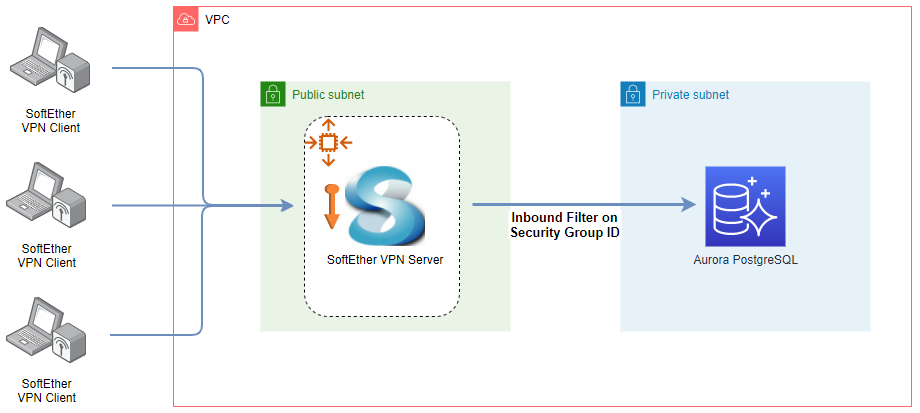

# Terraform Development Environment

Source for <a href="https://cevo.com.au/post/simplify-your-development-on-aws-with-terraform/" target="_blank">Simplify Your Development on AWS with Terraform</a>.



## Note

If you see the following error, change `user_data_base64` into `user_data`.

```
╷
│ Error: Unsupported argument
│ 
│   on vpn.tf line 22, in module "vpn":
│   22:   user_data_base64 = base64encode(join("\n", [
│ 
│ An argument named "user_data_base64" is not expected here.
╵
```
